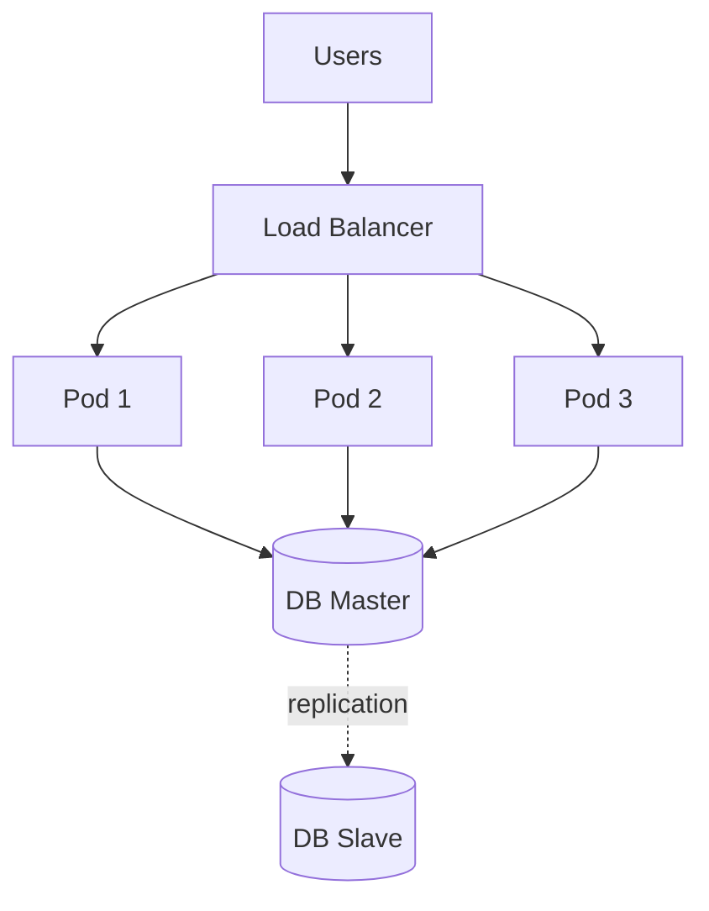
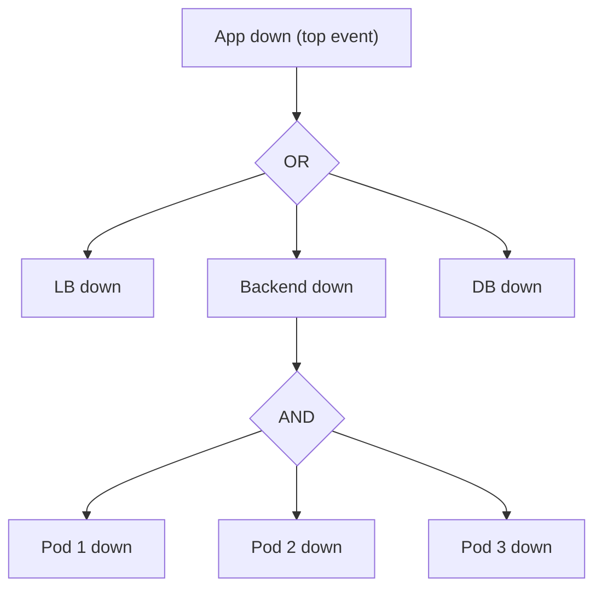

*Nancy Leveson: A Name Every SRE Should Know.*

> [!note]- AI Usage Disclosure
> AI helped structure the argument, verify references, and check the availability math. Every opinion is mine.

At the end of 2024, USENIX published a short article by two Google engineers: *The Evolution of SRE at Google*. The second author is Benjamin Treynor Sloss, the man who coined the term Site Reliability Engineering in 2003. The article's argument is a quiet bombshell: the future of SRE, at Google and everywhere else, is a framework called STAMP, developed by an MIT professor named Nancy Leveson.[^1]

Read that again. The person who named the field is telling us the next step is the work of a safety engineer most SREs have never heard of. When that happens, you stop and look.

## Who is Nancy Leveson?

Nancy Leveson is a professor of aeronautics and astronautics and engineering systems at MIT. For five decades she has studied one question: why do complex, software-controlled systems kill and maim people, even when every component was working? She investigated the [Therac-25](https://en.wikipedia.org/wiki/Therac-25) radiation machine, which massively overdosed cancer patients in the 1980s through software and human-interface failures, and wrote it up in the paper that became the reference on how software causes accidents.[^2] She was a consultant to the Columbia Accident Investigation Board. Her 1995 book *Safeware* is the foundational text of software safety.[^3]

But her real contribution is the framework she spent the 2000s building: STAMP, the System-Theoretic Accident Model and Processes, published in *Engineering a Safer World* (2011).[^4] It is the most serious attempt I know to replace how we think about failure in complex systems. Google just bet on it. That is what this post is about.

## SRE's forgotten root

I have written before that Agile's practitioners forgot Agile's root. The root is Drucker's knowledge worker; the ceremonies are just the surface.[^5] SRE has the same disease one generation up the chain.

SRE did not invent itself out of nowhere. It grew out of safety engineering, the discipline that grew out of systems theory and cybernetics: Wiener, Ashby, and the mid-century effort to understand feedback and control. Treynor Sloss's founding definition of SRE, "what happens when you ask a software engineer to design an operations function," is a safety engineer's instinct wearing a software shirt. The postmortem, the error budget, the blameless culture: every one of these descends from a safety tradition. The SRE book's chapter on [blameless postmortems](https://sre.google/sre-book/postmortem-culture/) admits it in a single line: blameless culture "originated in the healthcare and avionics industries where mistakes can be fatal." The recommendation Google is famous for is rooted in safety engineering, borrowed from the very field SRE has since stopped reading.

And then the field forgot the root, the way Agile forgot Drucker. SRE practice today is mostly reliability engineering: make the components fail less often, measure uptime, fix the thing that broke. That is the shallow version of the discipline, and it is running out of road. The connection to safety engineering needs to be taken seriously again. Leveson is the person who can reconnect us.

## Reliability is not safety

Here is the idea that separates Leveson from everything most SREs have read:

> Reliability is a property of components. Safety, and more broadly the ability of a system to avoid unacceptable losses, is a property of the system as a whole.

A system built from reliable parts can still fail catastrophically. The classic example is the aircraft with an engine on fire and a working fire-suppression system, whose crew shut off the wrong engine: every component functioned as designed, and the plane still went down. Therac-25 is the software version: the machine's parts were fine, the software was "reliable," and patients died anyway. In these systems the accident is not a broken part. It is an interaction between parts that were all behaving correctly.

SRE has quietly been living inside the component-failure model. "Reliability" to most of us means availability: the percentage of time the thing is up. That framing works until the losses stop being about uptime. Google's own article makes this point in its own words: error budgets worked for stateless web services, but today's products have "losses that must never occur, error budgets of zero," things like data loss, privacy breaches, and regulatory failures.[^1] At that point the reliability lens, however well executed, is answering the wrong question.

And this is not a niche concern for aerospace. Software is full of safety-critical systems that have quietly ignored safety engineering: payments, health records, identity, ledgers, anything that moves money or controls machines. The field that should be teaching us how to think about them is the one we stopped reading.

## The classic methods, and the model hiding underneath

The traditional safety toolbox has three big tools, and SRE absorbed all three without noticing they share one assumption.

**Fault Tree Analysis (FTA)** starts at the top with an undesired event, say "the app is down," and works downward through AND and OR gates until it reaches basic component failures. It assigns each component a failure probability and multiplies its way to a system number. Born at Bell Labs in the early 1960s for missile launch control, it is still the workhorse of availability math.

**Failure Mode and Effects Analysis (FMEA)** goes the other way, bottom up: enumerate every component, list its failure modes, trace each one's effect up through the system. Born in 1940s military procurement and formalized by NASA, it is the "list everything that can break" method.

**HAZOP** came out of chemical engineering in the 1960s. It walks through a process parameter by parameter, applying guide words like *no*, *more*, *less*, *reverse*, to ask what happens when each deviates. It is designed for flows you can enumerate.

Three different tools, one shared skeleton. Every one of them assumes that accidents are caused by component failures, and that if you prevent components from failing, or break the chain of events, you prevent the accident. The underlying model is a chain of events, the dominos falling, [Heinrich's model](https://en.wikipedia.org/wiki/Domino_theory_of_accident_causation) from 1931, refined into James [Reason's Swiss Cheese](https://en.wikipedia.org/wiki/Swiss_cheese_model) in 1990. This is a perfectly good model for a machine. It is the wrong model for a system.

## Where SRE's own tools break

SRE inherited the chain-of-events model and then built a culture on top of it. The postmortem asks for a root cause. The Five Whys dig for the one component that failed. The action items say: add a check, add redundancy, add a test, so that component fails less often. Google's article is blunt about what this produces: sentences like "a bug combined with insufficient rate limits caused thousands of servers to go offline" litter our postmortems.[^1]

The problem is not that we are sloppy. The problem is that the model itself breaks. Falzone and Sloss name the failure precisely: picking the first event in the chain, the "root cause," is subjective. When did the outage really begin? When the servers went offline? When the rate limit changed? When the bug was introduced? There is an infinite regress, and the root cause you pick is a choice, not a discovery.[^1]

And when the chain runs out of components to blame, we reach for the oldest non-answer in the book: **human error**. A postmortem that ends in "human error" has not finished the analysis. It has stopped it. In a control loop, a human is a component like any other, with inputs, a model of the system, and outputs. When a human does the "wrong" thing, it almost always means the feedback they received was wrong, or the goal they were given was unachievable, or the system's state was invisible to them. "Human error" is where analysis should begin, not where it ends. Steven Shorrock, a human factors specialist, made this case to a web operations audience in ["Life After Human Error"](https://www.youtube.com/watch?v=STU3Or6ZU60) (Velocity Europe 2014). The aviation industry had learned it decades earlier and built an entire field on it. SRE wrote "blameless" on the wall and kept blaming the human anyway.

There is a deeper limit too. Postmortems reason from what happened to what might happen next: induction. Induction is powerful when you have a lot of data. But the failures we work hardest to prevent are exactly the ones that have never happened, so there is no data. You cannot learn your way to anticipating an outage class that has not occurred yet.[^1]

## STAMP: the accident as a control problem

Leveson's move is to throw away the chain-of-events model entirely and replace it with a control model. STAMP says: an accident is not a chain of failures. It is a control problem. The system was supposed to enforce some constraint, some safety requirement, and the control that was supposed to enforce it was missing, wrong, or ineffective.

The intellectual roots go back to cybernetics. Ashby's *An Introduction to Cybernetics* (1956) laid out what any controller needs, and Leveson adapted it into a checklist of four conditions. To control a process you need:[^6]

> **A goal.** The controller must be trying to maintain something, a setpoint.
> **A way to act.** The controller must be able to change the system's state.
> **A model.** The controller must carry a model of the system it is controlling.
> **A way to observe.** The controller must be able to see the system's current state.

Read that checklist and think about your own systems. The failure is rarely in the goal. It is almost always in the model or the feedback.

Out of STAMP come two practical tools. **STPA** (System-Theoretic Process Analysis) is the forward-looking one: given a design, find the ways its controls can be inadequate, before anything fails. **CAST** (Causal Analysis based on System Theory) is the backward-looking one: given an accident, explain why the controls were ineffective. STPA is the replacement for FTA and FMEA. CAST is the replacement for the root-cause postmortem.

Two more ideas round out the frame.

First, **hazard states, not events**. An accident is not a moment. A system can sit in a dangerous state for a long time before anything bad happens: a bug introduced but never triggered, an alert that fires but reaches no one, a service under-provisioned for weeks. STAMP calls these hazard states, and they are a property of the whole system, not of any component. That gives you a much bigger, much earlier target than chasing individual failures. Instead of asking "what broke," you ask "how could this system enter a state where a small disturbance turns into a loss, and how do we keep it out?"

Second, **unsafe control actions**. STPA classifies every way a control can go wrong into exactly four types: the required action is not provided; the wrong action is provided; the action comes at the wrong time or in the wrong order; the action stops too soon or lasts too long. That is the whole taxonomy. It is small, and it is enough.

Leveson's own summary of the shift is worth quoting: understanding an accident means determining why the control was ineffective, and prevention means shifting "from a focus on preventing failures to the broader goal of designing and implementing controls that will enforce the necessary constraints."[^7]

Enough theory. Let me make it concrete.

## Part two: one platform, seen two ways

Imagine a platform team responsible for the company's cloud infrastructure. Their crown jewel is a small service: a three-pod backend behind a load balancer, with a master-slave database. It runs on Kubernetes. One morning it goes down, and we are going to look at that morning through two different lenses.

First, the classic lens: FTA.

## What FTA sees

FTA asks: what is the top event, and what component failures combine to cause it? The top event is "the app is unavailable." Draw the tree:

The app is down if the load balancer is down **or** the backend is down **or** the database is down. The backend is down only if all three pods are down. That is the tree. Before we assign numbers, we need to say what a number means:

> **Availability** is how often the service keeps its promise. [Google's SRE book](https://sre.google/sre-book/embracing-risk/) measures it two ways: *time-based*, the fraction of time the service is up, and *aggregate*, the fraction of requests that succeed. The promise itself is yours to define: for this service, say, a successful HTTP status with a p99 latency under 0.5 seconds. Everything that follows is arithmetic over this one number.

Now assign numbers. I will pick illustrative ones, the kind a capacity planner would assume:

- Load balancer: 99.99%, so $A_{\text{lb}} = 0.9999$.
- Each pod: 99.9%, so $A_{\text{pod}} = 0.999$.
- Each database node, master or slave: 99.9%, so $A_{\text{node}} = 0.999$.

For components in series, availability multiplies. For three redundant pods, where any one of them can carry the load, the backend is down only if all three pods fail, so:

$$A_{\text{backend}} = 1 - (1 - A_{\text{pod}})^3 = 1 - (1 - 0.999)^3 = 1 - 0.001^3 = 0.999999999$$

The backend looks bulletproof, as redundancy always does. The database is the question. If we are honest that the master is a single point of failure and the slave is just a lagging copy, then the database is available exactly when the master is: $A_{\text{db}} = A_{\text{node}} = 0.999$. That gives:

$$A_{\text{app}} = A_{\text{lb}} \times A_{\text{backend}} \times A_{\text{db}} = 0.9999 \times 0.999999999 \times 0.999 \approx 0.9989$$

That is 99.89%, about 9.6 hours of downtime a year. If we are generous and model the slave as a perfect hot standby, so the database only fails when both nodes fail at once:

$$A_{\text{db}} = 1 - (1 - A_{\text{node}})^2 = 1 - (1 - 0.999)^2 = 0.999999$$

and the app climbs to roughly 99.99%, about 53 minutes a year. The truth sits between, closer to the pessimistic number once you count replication lag, split-brain, and the failover tooling itself failing.

This is what FTA gives you, and it is genuinely useful: a number, and a clear pointer that the database is your single point of failure. Every reliability engineer I know has done this calculation, and it is not wrong. It is just not the whole story, and the part it misses is the part that actually takes you down.

## What FTA misses: the readiness cascade

Here is what actually happened that morning.

Traffic spiked. The pods came under load. Under load, each pod's readiness probe, a small HTTP check that the platform team configured to confirm the pod can serve traffic, started timing out. When a readiness probe fails, Kubernetes removes the pod from the service's endpoints, so the load balancer stops sending it traffic. That is the design: do not route to a pod that cannot serve.

But the pod was not broken. It was busy. The probe was timing out because the pod was saturated, and the probe's job is to measure "can serve," not "is busy." The controller's model equated "probe passes" with "healthy," and under load that model was wrong. So the controller, working exactly as designed, removed a pod that was actually the last thing standing between the system and collapse. The traffic that pod was carrying shifted to the remaining two. Now they were saturated. Their probes timed out too. They got removed. The backend went from three pods to zero, and the app was down.

No component failed. The pods, the probes, the kubelet, the service controller: every single one did precisely what it was designed to do. The interaction killed the system.

Now look at what FTA said. The backend's $1 - (1 - 0.999)^3$ calculation assumes the pods fail independently. They do not. One pod failing readiness *causes* the others to fail. The failure is correlated by design, and the correlation is invisible to the AND gate. The formula quietly assumed a world in which pods drop out at random, and computed a backend that is essentially unbreakable, while the actual system collapsed to zero because of a feedback loop the tree cannot even represent. The number was honest arithmetic about a model that does not describe your system.

FMEA does no better. Bottom up, it lists pod failure modes: container crash, node failure, OOM kill. A pod being removed by a correctly-functioning readiness probe is not a failure mode, so it does not appear on the list. HAZOP does no better: there is no parameter in the flow diagram called "readiness," and no guide word that captures "the probe that protects you becomes the thing that kills you." The cascade is invisible to all three classic tools, because all three are looking for broken parts, and there are no broken parts to find.

## What STPA sees

Now the same system through Leveson's lens.

STPA asks you to draw the system as control loops and then hunt for the ways the controls can be inadequate. The readiness probe is not a "check." It is a feedback loop. The service selector is a controller. Redraw the morning as control:

The controller is the kubelet running the probe, together with the service controller that routes traffic. Its **goal** is to route traffic only to pods that can serve it. Its **action** is adding or removing a pod from the service's endpoints. Its **model** is "the readiness probe passing equals healthy." Its **feedback** is the probe result.

Run Ashby's four conditions over it. Goal: fine. Action: fine. Model: wrong. Feedback: broken. The probe does not measure what the controller assumes it measures. Under load, "ready" and "saturated" become indistinguishable to a timeout. The control action that follows, removing the pod, is an unsafe control action: an inadequate action provided at the worst possible moment, feeding a cascade.

This is the second type of unsafe control action: an incorrect or inadequate control action provided. But notice where STPA points you. Not at the pod. Not at the probe code. At the *feedback path*, the place where the controller's view of the world diverged from the world. Google's article found exactly the same thing in its own case study, and they said it plainly: the feedback path is usually less well understood than the control path, but just as important.[^1]

The same lens catches the autoscaler before it bites. Imagine a Vertical Pod Autoscaler that watches resource usage and trims a deployment's requests to save money. Its goal is efficiency. Its action is lowering the requests. Its feedback is the usage metric. If that metric is wrong or lagging, say it underreports a spike, the autoscaler reliably shrinks a service's allocation below what it needs, the pods get OOM-killed under the next load, and you have an outage caused by a component doing its job on bad feedback. Google's own case study is almost word for word this: a quota rightsizer that shrunk a critical service's quota based on incorrect usage data, sat in a hazard state for weeks because nobody was watching the feedback path, then caused a real outage when the reduction was applied.[^1]

That is the shift in one image. FTA hands you a number and a single point of failure. STPA hands you the control structure and says: here is every place your controller can be right about the action and wrong about the world, and here is where to look before anything breaks.

## Where this leaves SRE

I want to be careful not to overclaim. FTA is not useless. The availability number is real, the single-point-of-failure finding is real, and if your job is capacity planning you should keep doing the math. What I am arguing is narrower and bigger at the same time: the availability number answers a question that is not the whole question, and the tools SRE inherited for understanding *incidents* are built on a model of the world that stopped being true the moment our systems became complex.

A few concepts, then, as a place to start the discussion. Not a checklist, because I do not have one yet. Concepts.

**Model the system as control loops, not boxes and arrows.** Every architecture diagram is drawn as data flow. Try drawing the same system as controllers, actions, and feedback. Ask: who controls what, and what does each controller think the world looks like? The interesting failures live in the gap between the model and the world.

**Hunt hazard states, not failure events.** Ask what conditions the system can sit in for weeks, invisible and dangerous, before anything bad happens. A bug never triggered, an alert that reaches no one, an under-provisioned service. Those are your targets, and they are bigger and earlier than any single failure.

**Replace "what component failed?" with "what interaction was inadequately controlled?"** This is the question that actually finds the readiness cascade and the autoscaler, because it does not assume anything broke.

**Replace root cause with CAST.** Stop asking what the first event was. Ask why the control was ineffective and why the constraint was not enforced. The answer is never one component; it is a control structure that was missing a sensor or carrying a bad model.

**Let "human error" open the analysis, not close it.** The human is a component in the loop with inputs and a model. If the human did the wrong thing, the interesting question is what feedback made that the right thing to do, and what the system would have to change so the next human does not.

And one more, the one that ties the whole thing together. SRE came from safety engineering. We forgot. The person who named the field has started walking back, and he is pointing at Nancy Leveson's work. The rest of us should at least read the map.

> [!note] A disclosure, thinking out loud
> I keep circling a question I have not settled: maybe the safety engineer should be a separate role in the org, not a hat an SRE wears on top of everything else. A dedicated safety engineer would be free to go wherever the criticality is, even into the frontend code, and come back demanding mutation-based testing coverage, or to conclude that one server module needs formal verification or fuzz testing. To apply STAMP at all, that person would also need observability across the full software lifecycle of every team involved, from first commit to production. None of this is a conclusion. I am sharing the thought because I have not settled it.

## Further reading

Works that shaped this post but are not cited above:

- Sidney Dekker, [*The Field Guide to Understanding 'Human Error'*](https://sidneydekker.com/books/): the definitive treatment of why "human error" is a starting point, not a conclusion.
- Richard Cook, [*How Complex Systems Fail*](https://how.complexsystems.fail/): a short essay that says in twenty minutes what most reliability books take three hundred pages to say.
- Erik Hollnagel, [*Safety-I and Safety-II*](https://www.erikhollnagel.com/): a parallel tradition to Leveson's, arguing we should study why things go right, not only why they go wrong.

## A note on this version

This is a beta. The STAMP framing and the two examples are settled in my head; the sourcing and the availability math are the parts I want pressure-tested. Specifically: the master-slave failover modeling is simplified on purpose and deserves a sharper treatment, and I have not yet decided whether this reads better as one long piece or two. Corrections and counterarguments are welcome, especially from anyone who has actually run STPA on a production system.

[^1]: Tim Falzone and Benjamin Treynor Sloss, "The Evolution of SRE at Google: Using STAMP to improve resilience in Google production systems," USENIX *;login:* Online, December 18, 2024. [usenix.org/publications/loginonline/evolution-sre-google](https://www.usenix.org/publications/loginonline/evolution-sre-google).
[^2]: Nancy G. Leveson and Clark S. Turner, "An Investigation of the Therac-25 Accidents," *IEEE Computer* 26, no. 7 (July 1993). The classic account of how software and interface design killed patients while every component "worked."
[^3]: Nancy G. Leveson, *Safeware: System Safety and Computers*, Addison-Wesley, 1995.
[^4]: Nancy G. Leveson, *Engineering a Safer World: Systems Thinking Applied to Safety*, MIT Press, 2011. Freely available at [sunnyday.mit.edu](https://sunnyday.mit.edu/safer-world.pdf).
[^5]: See [[the-root-of-agile]], where I argue Agile's root is Drucker's knowledge worker, not the ceremonies.
[^6]: W. Ross Ashby, *An Introduction to Cybernetics*, 1956, as adapted by Leveson and quoted in Falzone and Sloss. The four conditions are Leveson's summary of Ashby's control requirements, not a direct Ashby quote.
[^7]: Leveson, *Engineering a Safer World*, 2011, as quoted in Falzone and Sloss.
